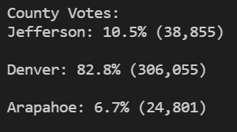

# PyPoll - Election Audit Analysis

## Overview of Project
The only thing more important than voting is the counting of those votes.  An audit of a recent election is underway to ensure the correct candidate won. A comma separated values (CSV) file supplied a complete list of Voter ID, County, and chosen candidate for analysis. This project utilized Python to quickly loop through the data, and provide insights on the outcomes. 

### Purpose
Using Python, the election results will be analyzed and report the total votes and the votes' distribution by candidate and county. From the calculations, the county and the candidate with the most votes can be identified. Ideally, the code can be used for future audits with slight modifications. 

## Results
### Code Overview
To store the unique values for the counties and candidates found in the original CSV file, the script utilized an array for each respective category. Two dictionaries were also constructed in order to hold the vote tally for each candidate and county name (i.e. {candidate name : votes}).
 
```
# Candidate Options and candidate votes.
candidate_options = []
candidate_votes = {}

# Create a county list and county votes dictionary.
county_options=[]
county_votes = {}
```
The script incorporated the csv module, and looped through each row of the CSV file to count the total votes, and store the candidate’s name from the third column and the county name from the second column. 

```
# Add to the total vote count
total_votes = total_votes + 1

# Get the candidate name from each row.
candidate_name = row[2]

# 3: Extract the county name from each row.
county_name = row[1]
```

Applying two identical if statements, the code then identified the unique values for candidates and counties and stored the votes accordingly in a dictionary. Below is the if statement for the county votes that is located within the broader for loop. 

```
if county_name not in county_options: 

	# 4b: Add the existing county to the list of counties.
   	county_options.append(county_name)

	# 4c: Begin tracking the county's vote count.
      county_votes[county_name]=0

 # 5: Add a vote to that county's vote count.
 county_votes[county_name]+=1

```

The script then calculated percentages and highlighted the candidate and county with the highest vote tally. It looped over the dictionary and used if statement logic and initially nulled variables to compare the county's and candidate's highest vote tallies and names.

```
    for county_name in county_votes:
        # 6b: Retrieve the county vote count.
        tally = county_votes.get(county_name)
        # 6c: Calculate the percentage of votes for the county.
        vote_percentage_county = float(tally) / float(total_votes) * 100
        county_results = (
        f"{county_name}: {vote_percentage_county:.1f}% ({tally:,})\n")

------------------------------------------------------------------

         # 6f: Write an if statement to determine the winning county and get its vote count.
        if (tally > county_turnout) and (vote_percentage_county > county_turnout_perc):
            largest_county = county_name
            county_turnout = tally
            county_turnout_perc = vote_percentage_county
```

For user convenience, the script outputs the results in the terminal window as well as a text file. 

```
# 7: Print the county with the largest turnout to the terminal.
        largest_county_summary = (
        f"-------------------------\n"
        f"County with largest Turnout: {largest_county}\n"
        f"County Vote Count: {county_turnout:,}\n"
        f"County Percentage: {county_turnout_perc:.1f}%\n"
        f"-------------------------\n")
    print(largest_county_summary)

    # 8: Save the county with the largest turnout to a text file.
    txt_file.write(largest_county_summary)
```

The full script can be found [here](./PyPoll_Challenge.py). 

### Voting Results
* There were 369,711 votes casted in this election. 
* The voting distribution by county is as following: 

* From the distribution, Denver County overwhelmingly had the highest votes with 82.8% of the votes. 
* The voting distribution by candidate is as following:

* The winner from these three counties is Diana DeGette. She received 272,892 votes, which is 73.8% of the total votes.

The summary of the votes can be found in [this text file](analysis/election_analysis.txt).


## Summary
The PyPoll code was created with consideration for future audits and elections. The code can handle reading through any CSV file that can contain any number of candidates or counties without any code modifications. 

### Future Modifications
Each project has its own individual needs. This code was written so it could be modified slightly to be applied to different scenarios. Examples of possible modifications could include: 
1. Additional raw information: 
     - A CSV file with multiple candidates on the ballot when each position has a designated column (i.e., President in Column 3, Vice President in Column 4, etc.), or regional/subdistrict information in additional columns (i.e., state, neighborhood, etc.). 
     - The code would need a new array, a new dictionary, and 3 variables for most votes, number of votes and percentages for each additional column in the CSV. The same workflow would be applied to each new position / location. 
2. Additional workflows: 
     - The result per candidate per county can be reported. It would highlight which candidate had the popular vote in each county and delineate voter trends.  
     - Using an additional for loop and if statement, the votes could be categorized by county and candidate.  
     
